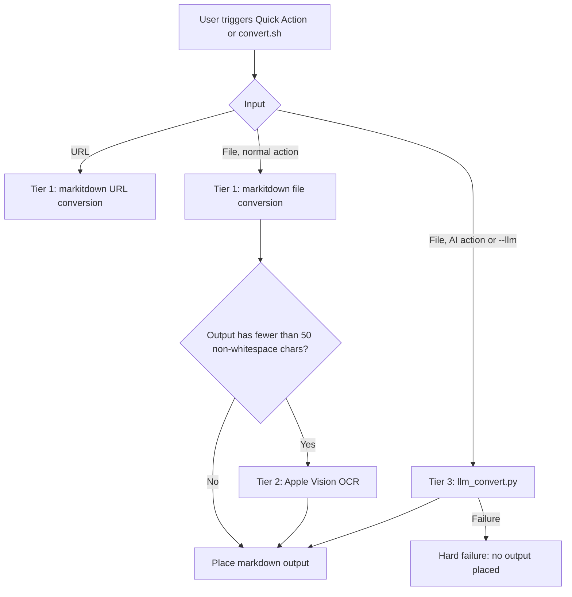

# Architecture

## Overview

markitdown-automator is a macOS shell-script tool that wraps Microsoft's `markitdown` Python CLI as native Automator Quick Actions. No build step; no test framework beyond the shell.

---

## Three-Tier Conversion Pipeline

Every file conversion goes through up to three tiers, stopping as soon as a tier produces substantive output.



**Tier 2 trigger condition:** `is_blank_output()` checks whether `$tmp` contains fewer than 50 non-whitespace characters after Tier 1 runs. Tier 2 then runs only for supported OCR input types: PDF, JPEG, PNG, GIF, TIFF, HEIC, WebP, and BMP. This catches empty image/PDF outputs without truncating minimal-but-valid Tier 1 output for unsupported formats such as EPUB.

**Tier 3 trigger condition:** `--llm` or the "Convert to Markdown (AI)" Quick Action. Tier 3 file conversion runs directly against the source file; it does not require Tier 1 to succeed first.

**Tier 3 failure semantics:** Hard failure — the file is counted as failed and no output is placed. Existing `.md` output is not backed up or modified after a Tier 3 failure.

**Tier 2 failure semantics:** Soft failure — a blank `.md` is placed (same as today's markitdown behavior pre-patch). A WARN is logged.

**URL inputs:** Only Tier 1 runs. URLs are text-based; Vision OCR and LLM vision don't apply.

---

## File Layout

```bash
setup.sh                          → installer / uninstaller / --configure-keys
scripts/
  convert.sh                      → core conversion logic (three-tier pipeline)
  vision_ocr.swift                → Swift source → compiled to binary by setup.sh
  llm_convert.py                  → Python LLM vision converter (OpenAI + Anthropic)
workflows/
  Convert to Markdown.workflow    → Finder Quick Action (files, Tier 1+2)
  Convert URL to Markdown.workflow → Safari Services Quick Action (URLs, Tier 1 only)
  Convert to Markdown (AI).workflow → Finder Quick Action (files, Tier 3 explicit)
docs/
  Architecture.md                 → this file
  Features/                       → behaviour specs and implementation plans
tests/
  run_tests.sh                    → test suite
  test_files/                     → fixture files for tests
    expected_outputs/             → expected .md outputs (used by content-comparison tests)
.claude/
  commands/                       → project slash commands (skills)
    fix.md                        → /fix  — autonomous bug-fix loop
    validate.md                   → /validate — static checks (bash -n, plutil, py_compile)
    add-fixture.md                → /add-fixture — add test fixture + wire up tests
    ship.md                       → /ship — pre-commit checklist
    add-workflow.md               → /add-workflow — scaffold Automator Quick Action
```

### Runtime install locations (created by setup.sh)

```bash
~/.markitdown-venv/               → Python venv with markitdown[all], pymupdf, Pillow, openai, anthropic
~/.markitdown-automator/
  scripts/
    convert.sh                    → installed copy (what workflows actually call)
    vision_ocr                    → compiled binary
    llm_convert.py                → installed copy
  config                          → PREFERRED_LLM_PROVIDER=openai|anthropic (optional)
~/Library/Services/
  Convert to Markdown.workflow
  Convert URL to Markdown.workflow
  Convert to Markdown (AI).workflow
~/Library/Logs/markitdown-automator.log
```

### Installer dependency bootstrap

`setup.sh` checks dependencies before installing project files:

- Required macOS commands: `plutil`, `security`, `osascript`, `sw_vers`
- Required runtime: Python 3.10+
- Optional bootstrap: Homebrew, used only when Python 3.10+ is missing or too old
- Optional OCR toolchain: Xcode Command Line Tools (`swiftc`, `xcrun`, SDK path)

Before running a dependency installer that may request an administrator password, `setup.sh` prints what will be installed, why it is needed, and that password entry is handled by macOS/sudo and is not saved by this project.

If Xcode Command Line Tools are missing, setup can open Apple's installer and then continues without Tier 2 OCR until setup is rerun after the tools finish installing.

`bash setup.sh --help` is read-only and prints supported modes, dependency behavior, admin-password handling, install locations, Keychain services, restart guidance, and log location without running dependency checks or changing files.

`bash setup.sh --uninstall` removes project-owned files, workflows, the project venv, and `~/Library/Logs/markitdown-automator.log`. It prompts before removing Keychain API keys. Shared dependencies such as Homebrew and Homebrew-installed Python are kept by default and require explicit opt-in removal; Xcode Command Line Tools are not removed by the script.

---

## Data Flow: File Conversion

```bash
Quick Action → Automator bootstrap (document.wflow COMMAND_STRING)
    → bash ~/.markitdown-automator/scripts/convert.sh [--llm auto] "$@"
        → for each input file:
            mktemp $dir/.markitdown-tmp-XXXXXX → $tmp
            if --llm: python llm_convert.py "$input" "$tmp"
            else: markitdown "$input" -o "$tmp"
            if not --llm and blank: vision_ocr "$input" > $tmp
            backup existing output.md → output.bak.md (if needed)
            mv $tmp → output.md
        → osascript notification (success count / failure count)
```

## Data Flow: LLM Conversion (Tier 3)

```bash
llm_convert.py --provider openai|anthropic --api-key KEY input output
    ├─ PDF → pymupdf renders pages to PNG bytes at 150 DPI
    │        → vision API per page (PDF_PROMPT)
    │        → pages joined with "\n\n---\n\n"
    └─ Image → read bytes directly (GIF/TIFF/BMP/HEIC → PIL → PNG first)
               → vision API (IMAGE_PROMPT)
    → atomic write: output.llm-tmp → os.replace → output
```

---

## convert.sh Key Behaviors

| Behavior | Detail |
| ----------- | -------- |
| Temp-first writes | Converts to `mktemp` file; moves into place only on success |
| Backup on overwrite | Existing `output.md` → `output.bak.md` (then `.bak1.md`, etc.) |
| In-run collision tracking | Two inputs with same stem get `report.md` + `report-2.md` |
| Signal handling | `trap cleanup EXIT` + `trap 'exit 130' INT` + `trap 'exit 143' TERM` |
| Blank detection threshold | < 50 non-whitespace chars in Tier 1 output triggers Tier 2 |
| --llm flag | `--llm [auto\|openai\|anthropic]` — must precede file arguments |

---

## API Key Management

Keys are stored in **macOS Keychain**, never in files.

| Provider  | Keychain service name      | Account    |
|-----------|----------------------------|------------|
| OpenAI    | `markitdown-openai`        | `api-key`  |
| Anthropic | `markitdown-anthropic`     | `api-key`  |

Preferred provider when both are configured: `~/.markitdown-automator/config` → `PREFERRED_LLM_PROVIDER=openai|anthropic`

Configure: `bash setup.sh --configure-keys`
Retrieve (runtime): `security find-generic-password -s markitdown-openai -a api-key -w`

---

## Workflow Bundle Format

`*.workflow` bundles are plist XML. Key files: `Contents/document.wflow` and `Contents/Info.plist`.

- `workflowTypeIdentifier: com.apple.Automator.servicesMenu` — makes it a Quick Action
- `serviceInputTypeIdentifier: com.apple.Automator.fileSystemObject` — accepts files (Finder)
- `serviceInputTypeIdentifier: com.apple.Automator.url` — accepts URLs (Safari Services)
- `inputMethod: 1` — files passed as shell arguments; `0` = via stdin
- `Contents/Info.plist` must declare `NSServices` — without it macOS silently ignores it
- `serviceApplicationBundleID: com.apple.finder` (lowercase f) for Finder workflows
- `serviceApplicationBundleID: com.apple.Safari` (capital S) for Safari workflows
- `Convert URL to Markdown.workflow` action categories are `AMCategoryText` and `AMCategoryInternet`

After editing a workflow bundle, re-run `setup.sh` to push it to `~/Library/Services/`.

---

## Vision OCR Binary (vision_ocr.swift)

Compiled from `scripts/vision_ocr.swift` during `setup.sh`. Requires macOS 11+.

- **PDFs:** `PDFKit.PDFDocument` → page thumbnail at 150 DPI → `VNRecognizeTextRequest`
  - Pages separated by `\n\n---\n\n` in output
  - Per-page failures emit `<!-- OCR failed for page N -->` inline; processing continues
- **Images:** `CGImageSourceCreateWithURL` → `CGImageSourceCreateImageAtIndex(source, 0)` → OCR
  - GIF: frame 0 only
- `VNImageRequestHandler.perform()` is synchronous — no DispatchSemaphore needed
- Exit 0 if any page succeeded; exit 1 if all failed

---

## Adding a New Format

To support a new input format in the pipeline:

1. **Tier 1** — markitdown handles it natively: nothing to do.
2. **Tier 2** — add the extension to `is_vision_ocr_supported()` in `convert.sh` and the supported input handling in `vision_ocr.swift`, then recompile via `setup.sh`.
3. **Tier 3** — add the extension to `IMAGE_EXTS` in `llm_convert.py`; add PIL conversion logic if the format isn't natively supported by OpenAI/Anthropic APIs.
4. Update the canonical supported-types docs in `AGENTS.md`, this file, and any affected feature doc.

---

## Feature Docs

- [AI Conversion Path](Features/ai-conversion-path.md) — explicit Tier 3 flow and missing-key failure behaviour.
- [Installer Dependency Bootstrap](Features/installer-dependency-bootstrap.md) — Homebrew/Python/Xcode dependency checks and admin-password disclosure.
- [Workflow Bundles](Features/workflow-bundles.md) — Finder/Safari Automator entry points, embedded shell snippets, and workflow validation.

---

## Known Constraints

- **Quick Actions require a system restart** to reliably appear after first install. `pbs -update` and `killall Finder` are insufficient in all cases.
- **Safari share sheet is not supported.** On macOS Ventura+, the share sheet toolbar button uses App Extensions only (`com.apple.share-services`). The URL workflow appears in Safari menu bar → Services only.
- **Vision OCR requires macOS 11+.** `setup.sh` skips compilation on older systems.
- **LLM Tier 3 caps at 50 pages** per PDF to bound cost. Large PDFs are truncated with a log warning.
