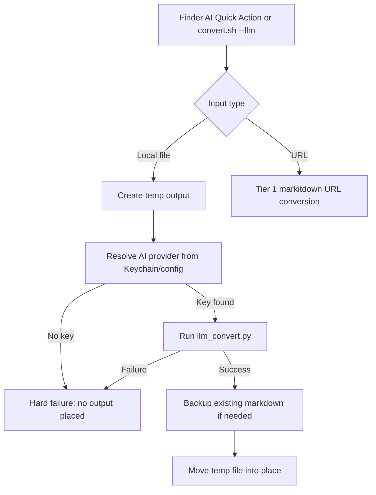

# Feature: AI Conversion Path

Links:
Architecture: `docs/Architecture.md`
Modules: `scripts/convert.sh`, `scripts/llm_convert.py`, `tests/run_tests.sh`

---

## Implementation plan

- [x] Analyze current behaviour and audit findings.
- [x] Make explicit `--llm` file conversion independent from Tier 1 conversion success.
- [x] Add focused tests for AI missing-key behavior and conversion exit-code handling.
- [x] Update architecture and README documentation.
- [x] Run validation and relevant test tiers, then record results.
- [x] Refresh verification results after the workflow and installer audits expanded the suite.

---

## Purpose

The AI Finder action is the explicit paid/slow conversion path. It must not depend on `markitdown` successfully converting a file first, because the user chose AI specifically for files where Tier 1 may be weak or unsupported.

---

## Scope

### In scope

- `convert.sh --llm` behavior for local files.
- Negative test coverage that verifies missing AI keys fail hard without placing output.
- Test harness checks that conversion commands exit with the expected status.
- README and architecture documentation for the three installed Quick Actions.

### Out of scope

- Real OpenAI or Anthropic API calls.
- Keychain service-name changes.
- Blank-detection threshold changes.
- Workflow UUID or `NSServices` structure changes.

---

## Business Rules

- Tier 3 is triggered only by `--llm` or the AI Quick Action.
- Tier 3 file conversion runs `llm_convert.py` directly and does not require Tier 1 output.
- Tier 3 failure is hard: no output is placed and any existing `.md` remains untouched.
- URL conversion remains Tier 1 only.

---

## System Behaviour

- Entry points: Finder AI workflow, `convert.sh --llm [auto|openai|anthropic] file ...`.
- Reads from: input files, macOS Keychain through `security`, optional installed config.
- Writes to: temp conversion files first, then final `.md` only after success.
- Error handling: missing AI key returns a failed item count and leaves output absent.
- Security: API keys stay in Keychain and are passed to the converter process via the `MARKITDOWN_API_KEY` environment variable — never on the command line — to prevent transient exposure through process listing.

---

## Diagrams

---

## Verification

### Test commands

- build: `bash setup.sh`
- test: `bash tests/run_tests.sh`
- units: `bash tests/run_tests.sh --units`
- tier 1: `bash tests/run_tests.sh --tier1`
- tier 2: `bash tests/run_tests.sh --tier2`

### Test flows

| ID | Description | Level | Expected result | Data / Notes |
| --- | --- | --- | --- | --- |
| NEG-001 | `--llm` with no configured key | Integration | Exit non-zero, no `.md` placed, existing `.md` not backed up | Fake isolated `HOME` and fake `security` command |
| NEG-002 | `--llm` with invalid mode argument | Unit | Exit non-zero with error message; no conversion attempted | `--llm invalid_mode /dev/null` via `run_convert_failure` helper |
| POS-001 | Tier 1 fixture conversion | Integration | Exit zero and output file has content | Existing real fixtures |
| EDGE-001 | Existing output backup | Integration | Exit zero, original output moved to `.bak.md` | Existing real fixture |

### Results

- `bash -n scripts/convert.sh` — pass.
- `bash -n tests/run_tests.sh` — pass.
- `bash -n setup.sh` — pass.
- `python3 -m py_compile scripts/llm_convert.py` — pass.
- `plutil -lint` on all workflow plist files — pass.
- `CLANG_MODULE_CACHE_PATH=/tmp/markitdown-clang-cache swiftc -typecheck scripts/vision_ocr.swift` — pass.
- `bash tests/run_tests.sh --units` — pass, 48 passed.
- `bash tests/run_tests.sh --tier1` — pass, 23 passed.
- `bash tests/run_tests.sh` — pass, 70 passed, 0 failed, 0 skipped.

---

## Definition of Done

- AI file conversion no longer depends on Tier 1 success.
- Negative AI no-key behavior is covered by automated tests.
- Tier 1 test helpers assert conversion exit status.
- Architecture and README match the implemented workflows.
- Static validation and relevant tests pass.
