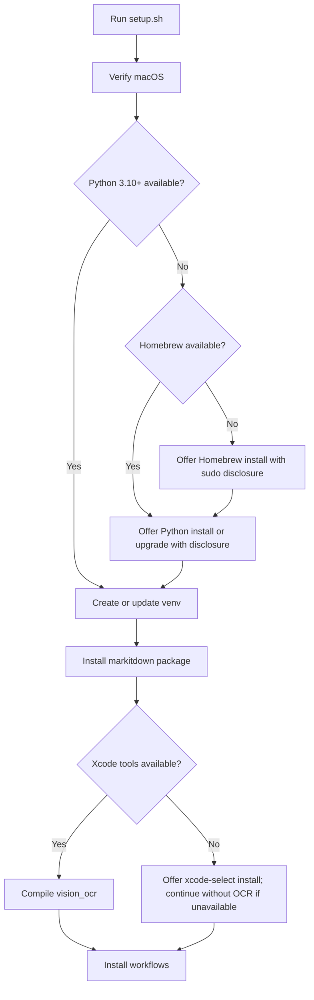
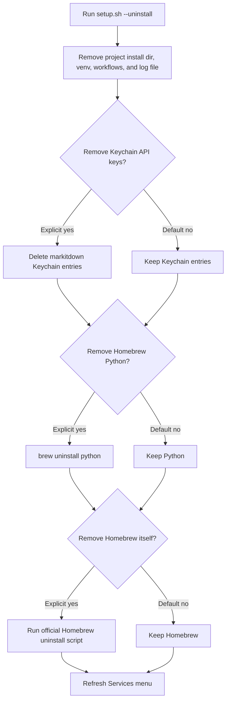

# Feature: Installer Dependency Bootstrap

Links:
Architecture: `docs/Architecture.md`
Modules: `setup.sh`, `tests/run_tests.sh`, `README.md`

---

## Implementation plan

- [x] Audit setup dependencies and current failure modes.
- [x] Add explicit dependency checks for Homebrew, Python 3.10+, and Xcode Command Line Tools.
- [x] Add clear sudo/admin-password disclosure before optional dependency installation.
- [x] Add `setup.sh --help` with modes, dependency behavior, password handling, and install locations.
- [x] Update README and architecture docs with installer behavior.
- [x] Add focused unit coverage for pure dependency/version helper logic.
- [x] Run validation and relevant tests, then record results.
- [x] Refresh public documentation after workflow-category and test-suite updates.
- [x] Add uninstall cleanup for logs and explicit opt-in prompts for shared dependencies.

---

## Purpose

First-time setup should not fail with only a vague "install Homebrew/Python" message. It should check dependencies in order, offer to install missing tooling where practical, and clearly explain any admin password prompt before macOS or Homebrew asks for credentials.

---

## Scope

### In scope

- Homebrew detection and optional installation.
- Python 3.10+ detection and optional installation through Homebrew.
- Xcode Command Line Tools detection and optional launch of Apple's installer.
- README and architecture documentation for dependency behavior.
- Unit coverage for shell helper logic that does not require network access or system changes.

### Out of scope

- Running Homebrew or Xcode installers during automated tests.
- Silently installing system dependencies without user consent.
- Changing Python package dependencies installed into the venv outside the already-required `markitdown[all]`, `pymupdf`, `Pillow`, `openai`, and `anthropic` set.
- Changing workflow bundle structure.

---

## Business Rules

- The installer must check whether a dependency exists before asking to install it.
- Any step that may prompt for an admin/sudo password must explain what will happen, why the password may be needed, and that this project does not save the password.
- Homebrew is used only to install or upgrade Python when the system lacks Python 3.10+.
- Xcode Command Line Tools are required only for compiling local Vision OCR; Tier 1 and Tier 3 can still install without OCR.
- `setup.sh --help` must be read-only and must not perform dependency checks, installs, Keychain changes, or workflow changes.
- `setup.sh --uninstall` must remove project-owned files and logs by default, but must keep shared dependencies such as Homebrew and Python unless the user explicitly opts in to removing them.
- Shared dependency uninstall prompts must default to no and explain that Homebrew/Python may be used by other projects.

---

## System Behaviour

- Entry point: `bash setup.sh`.
- Reads from: system PATH, `xcode-select`, `sw_vers`, Homebrew metadata.
- Writes to: Homebrew-managed locations when the user accepts installation, project install directories, Python venv, workflow install locations.
- Error handling: dependency install refusal or failure exits for required dependencies; OCR toolchain refusal/failure skips Tier 2 with a clear warning.
- Security: sudo/admin password entry is handled by macOS/Homebrew. The project never reads, stores, logs, or forwards the password.
- Uninstall cleanup: project-owned files, workflows, venv, and log file are removed automatically; Keychain entries and shared dependencies require separate confirmation.

---

## Diagrams

---

## Verification

### Test commands

- syntax: `bash -n setup.sh`
- units: `bash tests/run_tests.sh --units`
- full tests: `bash tests/run_tests.sh`

### Test flows

| ID | Description | Level | Expected result | Data / Notes |
| --- | --- | --- | --- | --- |
| UNIT-001 | Python version helper | Unit | Correctly accepts 3.10+ and rejects older/malformed versions | Inline shell helper mirrors setup logic |
| UNIT-002 | Uninstall help text | Unit | Documents log cleanup and that Homebrew/Python are kept unless explicitly confirmed | `setup.sh --help` output |
| MAN-001 | Missing Homebrew/Python first run | Manual | Installer explains Homebrew/Python install and sudo handling before prompting | Not automated because it mutates the host |
| MAN-002 | Missing Xcode tools | Manual | Installer explains Apple CLT install and continues without OCR if declined or unavailable | Not automated because it launches Apple installer |
| MAN-003 | Optional dependency uninstall | Manual | Defaults to keeping Keychain, Python, and Homebrew; removes only on explicit yes | Not automated because it can mutate shared host dependencies |

### Results

- `bash -n setup.sh` — pass.
- `bash -n tests/run_tests.sh` — pass.
- `bash -n scripts/convert.sh` — pass.
- `python3 -m py_compile scripts/llm_convert.py` — pass.
- `plutil -lint` on all workflow plist files — pass.
- `bash setup.sh --help` — pass.
- `bash tests/run_tests.sh --units` — pass, 48 passed.
- `bash tests/run_tests.sh` — pass, 73 passed, 0 failed, 0 skipped.

---

## Definition of Done

- Required dependency failures are actionable.
- Admin/sudo prompts are explained before they can appear.
- README describes first-run dependency behavior accurately.
- Uninstall removes project logs and keeps shared dependencies unless the user explicitly confirms removal.
- Static validation and unit tests pass.
