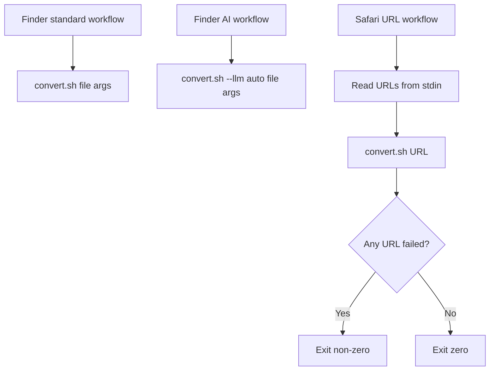

# Feature: Workflow Bundles

Links:
Architecture: `docs/Architecture.md`
Modules: `workflows/*.workflow`, `setup.sh`, `tests/run_tests.sh`

---

## Implementation plan

- [x] Audit all workflow plist files for syntax validity.
- [x] Confirm workflow metadata matches intended app/input routing.
- [x] Harden embedded shell snippets for stricter failure propagation.
- [x] Add automated checks for plist validity, embedded shell syntax, input method, and application scope.
- [x] Include the URL workflow in the Text and Internet Services categories.
- [x] Document the workflow-category requirement in README and architecture references.
- [x] Run validation and relevant tests.

---

## Purpose

The Automator bundles are the user-facing entry points. They must route Finder files, Safari URLs, and explicit AI file conversion to the correct `convert.sh` mode without hiding failures.

---

## Scope

### In scope

- Finder standard file workflow.
- Finder AI file workflow.
- Safari URL Services workflow.
- Embedded Run Shell Script command strings.
- Plist validation and workflow metadata checks.

### Out of scope

- Changing workflow UUIDs.
- Changing `NSServices` structure.
- Adding new workflows.
- Testing macOS Services menu refresh behavior, which requires the live user session.

---

## Business Rules

- Standard Finder workflow passes selected files as shell arguments and runs `convert.sh`.
- AI Finder workflow passes selected files as shell arguments and runs `convert.sh --llm auto`.
- Safari URL workflow reads URLs from stdin and runs `convert.sh` once per URL.
- URL workflow exits non-zero if no URL is received or any URL conversion fails.
- Workflow shell snippets validate the installed script exists before invoking it.
- URL workflow includes Automator action categories `AMCategoryText` and `AMCategoryInternet`.

---

## System Behaviour

- Entry points: Finder Quick Actions and Safari Services menu.
- Reads from: Finder argument list or Safari stdin.
- Writes to: no workflow files directly; conversion output is handled by `convert.sh`.
- Error handling: missing installed script displays a macOS notification and exits non-zero; URL workflow aggregates conversion failures.
- Security: shell snippets quote user-provided paths/URLs and delegate conversion to the installed script.

---

## Diagrams

---

## Verification

### Test commands

- plist validation: `plutil -lint workflows/*.workflow/Contents/*.plist`
- embedded shell validation: extract `COMMAND_STRING` and run `bash -n`
- units: `bash tests/run_tests.sh --units`
- full tests: `bash tests/run_tests.sh`

### Test flows

| ID | Description | Level | Expected result | Data / Notes |
| --- | --- | --- | --- | --- |
| UNIT-001 | All workflow plists are valid | Unit | `plutil -lint` passes | Local workflow files |
| UNIT-002 | Embedded shell snippets are valid | Unit | `bash -n` passes | Extracted `COMMAND_STRING` |
| UNIT-003 | Input methods are correct | Unit | Finder workflows use args; URL workflow uses stdin | PlistBuddy checks |
| UNIT-004 | App scoping is correct | Unit | Finder workflows use Finder; URL workflow uses Safari | PlistBuddy checks |
| UNIT-005 | URL workflow categories are correct | Unit | URL workflow uses Text and Internet categories | PlistBuddy checks |

### Results

- `plutil -lint` on all workflow plist files — pass.
- Extracted `COMMAND_STRING` from each workflow and ran `bash -n` — pass.
- `bash -n setup.sh && bash -n tests/run_tests.sh && bash -n scripts/convert.sh` — pass.
- `python3 -m py_compile scripts/llm_convert.py` — pass.
- `bash tests/run_tests.sh --units` — pass, 48 passed.
- `bash tests/run_tests.sh` — pass, 70 passed, 0 failed, 0 skipped.

---

## Definition of Done

- All workflow plists lint clean.
- Embedded shell snippets pass `bash -n`.
- Input methods and app scope match the intended workflows.
- URL workflow Services categories are covered by automated tests.
- Relevant tests pass.
